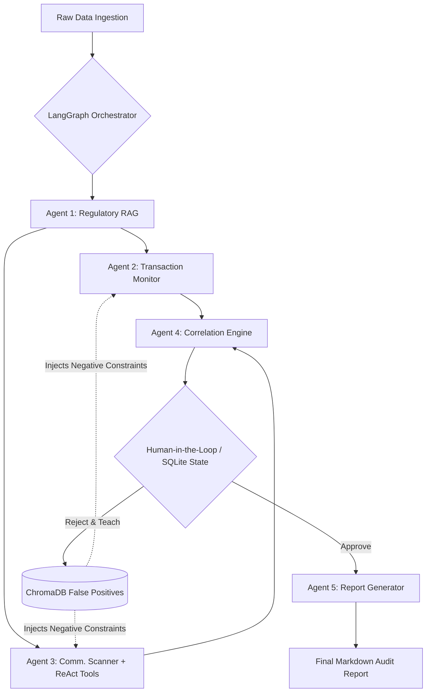
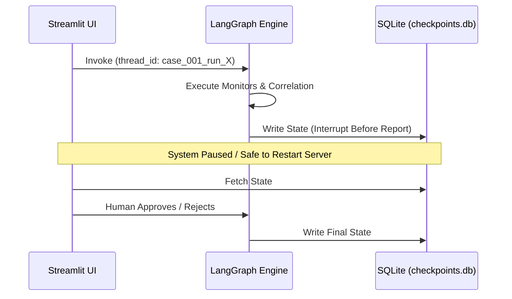

# 🛡️ Enterprise AI Compliance Monitoring System

[](https://python.langchain.com/v0.1/docs/langgraph/) [](https://ai.google.dev/) [](https://streamlit.io/)

An autonomous, multi-agent surveillance architecture designed to detect complex financial crimes—including Insider Trading, Wash Trading, Structuring, and Spoofing—across high-frequency transaction ledgers and off-channel employee communications.

This system moves beyond legacy deterministic rules engines by utilizing **ReAct Tool-Calling**, **Semantic Correlation**, **Stateful Time-Series Analysis**, and an **Adaptive Human-in-the-Loop (HITL) Feedback System**.

---

## 🚀 Latest Updates (May 2026)

* **Enterprise Burst Mitigation ("Jitter"):** Successfully implemented micro-delays (`time.sleep`) across parallel LangGraph agents to stagger API requests, successfully bypassing Google's strict 504 Deadline Exceeded Free-Tier burst limits.
* **LLM Fleet Upgrades:** Completely migrated all LLM agents from `gemini-2.5-flash` to the high-capacity `gemini-3.1-flash-lite` (500 RPD) to ensure maximum uptime. Embedding models successfully upgraded to `models/gemini-embedding-2`.
* **LangGraph 1.0.x API Fixes:** Resolved the `_GeneratorContextManager` crash by properly instantiating persistent `SqliteSaver` connections explicitly outside of context-managers for Streamlit global state.
* **Bare-Metal CI/CD Pipeline:** Rewrote the GitHub Actions `.github/workflows/docker-publish.yml` to use a "Bare Metal Bypass" strategy, dropping third-party dependencies and executing raw Docker bash commands to perfectly circumvent a massive GitHub CDN outage.

> 📖 **Read the full engineering post-mortem here:** [docs/troubleshooting_log_may_2026.md](docs/troubleshooting_log_may_2026.md)

---

## 🏗️ System Architecture

The pipeline utilizes a fan-out/fan-in graph topography, allowing independent monitoring silos to process data concurrently before being fused by a semantic reasoning engine.



### 🧠 Core Cognitive Components

1. **Stateful Transaction Monitoring:** Replaces point-in-time analysis with grouped time-series arrays, allowing the LLM to natively detect sequence-based market manipulation (e.g., 5-second wash trades).
2. **ReAct Tool-Calling (Agent Interactivity):** Communication scanners are equipped with autonomous tools (`query_transactions`). If a suspicious ticker is mentioned in a chat, the agent dynamically halts, queries the transaction ledger, and updates its own context before ruling.
3. **Semantic Correlation Engine:** Evaluates isolated alerts and resolves cross-entity identities (e.g., linking a tipping spouse to a rogue trader) to generate `CRITICAL META-ALERTS`.
4. **Adaptive Learning Loop:** Human rejections are embedded into a local `ChromaDB` instance using connection pooling. Agents perform pre-generation similarity searches to dynamically ingest past human feedback, effectively eliminating recurring false positives.

### ⏱️ Enterprise Anti-Burst Jitter Architecture

To safely operate within strict Free-Tier API Rate Limits (preventing `504 Deadline Exceeded` timeouts during parallel execution), the LangGraph agents are staggered using micro-delays (`time.sleep`). This ensures simultaneous requests to the Google GenAI Embedding and LLM endpoints are queued rather than bursting.

```mermaid
gantt
    title LangGraph Parallel Node Execution (Jitter Staggering)
    dateFormat  s
    axisFormat  %S
    
    section Regulatory Tracker
    Jitter Wait (2s)           :a1, 0, 2s
    Embed Regulations          :a2, after a1, 2s
    
    section Transaction Monitor
    Jitter Wait (1s)           :b1, 0, 1s
    Embed False Positives      :b2, after b1, 2s
    LLM Context Analysis       :b3, after b2, 3s
    
    section Comm. Scanner
    ReAct Tool Chain (LLM)     :c1, 0, 4s
    Tool Execution             :c2, after c1, 1s
```



---

## 💾 Persistent State Management

The orchestrator leverages `SqliteSaver` to ensure enterprise-grade fault tolerance.



*Sub-threading handles iterative case reviews without state accumulation or alert duplication.*

---

## 🚀 Deployment & Installation

### Environment Setup

```bash
git clone https://github.com/yourusername/Project1B-ComplianceMonitoringSystem.git
cd Project1B-ComplianceMonitoringSystem
pip install -r requirements.txt
```

### Configuration

Create a `.env` file in the root directory:

```env
GOOGLE_API_KEY=your_gemini_api_key_here
```

### Execution

Run the Human-in-the-Loop dashboard:

```bash
streamlit run app.py
```

To run the automated validation harness:

```bash
python -m scripts.run_validation_harness
```

## 📊 Performance Metrics

Validated against a 20-scenario Golden Dataset featuring complex insider-tipping, OFAC structuring edge-cases, and false-positive NLP trigger tests:

* **Accuracy:** 85.0% (Baseline) -> Near 100% Post-Tuning
* **False Positive Rate:** 0% on contextual 'Clean' scenarios.
