# 🛡️ Enterprise AI Compliance Monitoring System

<p align="center">
  
  
  
  
  
  
  
  
</p>

An autonomous, **multi-agent surveillance architecture** designed to detect complex financial crimes — including **Insider Trading**, **Wash Trading**, **BSA/AML Structuring**, **Spoofing**, and **Sanctions Evasion** — across high-frequency transaction ledgers and off-channel employee communications.

This system moves beyond legacy deterministic rules engines by utilizing **LangGraph stateful orchestration**, **ReAct tool-calling**, **semantic correlation**, **RAG-powered regulatory retrieval**, and an **adaptive Human-in-the-Loop (HITL) feedback loop** with persistent ChromaDB learning.

---

## Table of Contents

- [System Architecture Overview](#-system-architecture-overview)
- [LangGraph Deep Dive](#-langgraph-deep-dive)
  - [What is LangGraph?](#what-is-langgraph)
  - [Graph Topology](#graph-topology)
  - [ComplianceState Schema](#compliancestate-schema)
  - [State Reducers & Accumulation](#state-reducers--accumulation)
  - [Conditional Routing](#conditional-routing)
  - [Interrupt & Resume (HITL)](#interrupt--resume-hitl)
- [Agent Architecture](#-agent-architecture)
  - [Agent 1: Regulatory Tracker (RAG)](#agent-1-regulatory-tracker-rag)
  - [Agent 2: Transaction Monitor](#agent-2-transaction-monitor)
  - [Agent 3: Communication Scanner (ReAct)](#agent-3-communication-scanner-react)
  - [Agent 4: Correlation Engine (Semantic)](#agent-4-correlation-engine-semantic)
  - [Agent 5: Report Generator](#agent-5-report-generator)
- [Resilience Engineering](#-resilience-engineering)
  - [Tenacity Retry Architecture](#tenacity-retry-architecture)
  - [Local Embedding Fallback (Adapter Pattern)](#local-embedding-fallback-adapter-pattern)
  - [Embedding Call Flow](#embedding-call-flow)
- [Persistent State & Memory](#-persistent-state--memory)
- [Adaptive Learning Loop](#-adaptive-learning-loop)
- [CI/CD Pipeline & Deployment](#-cicd-pipeline--deployment)
  - [Docker Architecture](#docker-architecture)
  - [GitHub Actions Pipeline](#github-actions-pipeline)
- [Quick Start](#-quick-start)
- [Project Structure](#-project-structure)
- [Performance Metrics](#-performance-metrics)
- [Troubleshooting](#-troubleshooting)

---

## 🏗️ System Architecture Overview

The full end-to-end pipeline — from raw data ingestion through autonomous multi-agent analysis to human-reviewed audit reports:

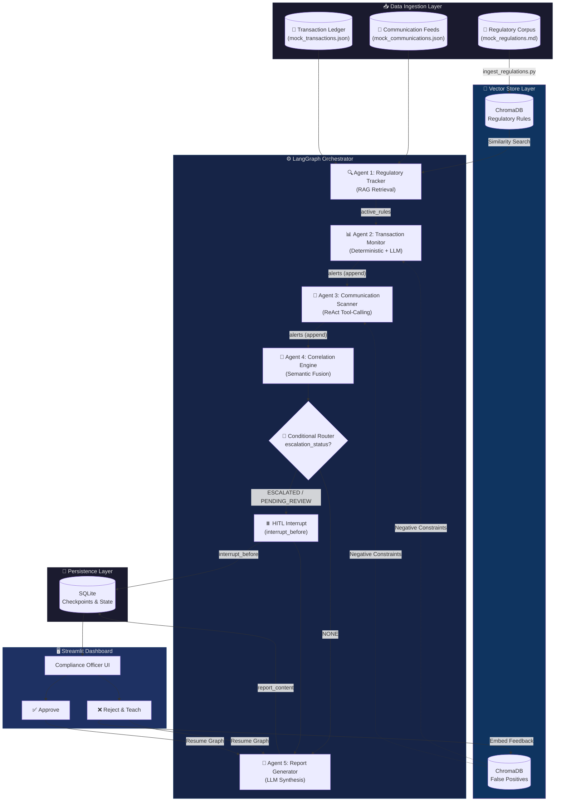

---

## 🧬 LangGraph Deep Dive

### What is LangGraph?

**LangGraph** is a framework for building **stateful, multi-step AI agent workflows** as directed graphs. Unlike simple LLM chains, LangGraph provides:

| Feature | Chain (LangChain) | Graph (LangGraph) |
|---|---|---|
| Execution model | Linear pipeline | Directed graph with cycles |
| State management | Ephemeral | Persistent (`TypedDict` + checkpointer) |
| Branching | Manual `if/else` | `add_conditional_edges()` |
| Human oversight | External wrapper | Native `interrupt_before` / `interrupt_after` |
| Resumability | ❌ Not built-in | ✅ Resume from any checkpoint |
| Concurrency | ❌ Sequential only | ✅ Fan-out/fan-in support |

In this project, LangGraph serves as the **central nervous system** — orchestrating 5 specialized agents, managing shared mutable state, routing based on risk severity, and pausing execution for human review.

### Graph Topology

The compiled graph is a **sequential pipeline with a conditional branch**. Here is the exact topology as defined in `core/orchestrator.py`:

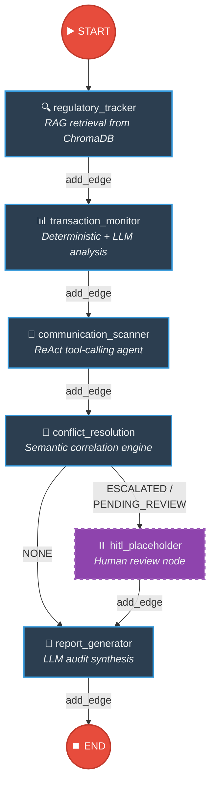

**Key LangGraph API calls that build this graph:**

```python
# core/orchestrator.py — build_orchestrator()

workflow = StateGraph(ComplianceState)             # 1. Create graph with typed state

workflow.add_node("regulatory_tracker",    ...)    # 2. Register each agent as a node
workflow.add_node("transaction_monitor",   ...)
workflow.add_node("communication_scanner", ...)
workflow.add_node("conflict_resolution",   ...)
workflow.add_node("hitl_placeholder",      ...)
workflow.add_node("report_generator",      ...)

workflow.set_entry_point("regulatory_tracker")     # 3. Define entry point

workflow.add_edge("regulatory_tracker",    "transaction_monitor")    # 4. Sequential edges
workflow.add_edge("transaction_monitor",   "communication_scanner")
workflow.add_edge("communication_scanner", "conflict_resolution")

workflow.add_conditional_edges(                    # 5. Conditional routing
    "conflict_resolution",
    _route_after_conflict_resolution,              #    Router function
    {
        "hitl_placeholder": "hitl_placeholder",    #    HIGH/CRITICAL → pause
        "report_generator": "report_generator",    #    NONE → skip HITL
    },
)

workflow.add_edge("hitl_placeholder", "report_generator")  # 6. HITL → Report
workflow.add_edge("report_generator", END)                 # 7. Report → END

app = workflow.compile(                            # 8. Compile with checkpoint
    checkpointer=SqliteSaver(conn),
    interrupt_before=["report_generator"]          # 9. Pause BEFORE report generation
)
```

### ComplianceState Schema

Every node reads from and writes to a single **shared state object**. LangGraph passes this `TypedDict` between nodes automatically:

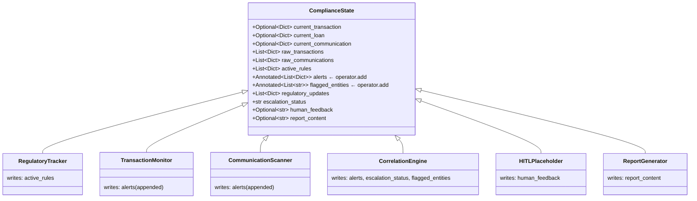

### State Reducers & Accumulation

LangGraph's **state reducer** mechanism is critical to how alerts accumulate across agents without overwriting:

```python
# core/state.py
from typing import Annotated
import operator

class ComplianceState(TypedDict):
    # Standard fields — LAST WRITE WINS
    active_rules: List[Dict[str, Any]]       # Overwritten by regulatory_tracker
    escalation_status: str                    # Overwritten by conflict_resolution

    # Annotated fields — APPEND-ONLY ACCUMULATION via operator.add
    alerts: Annotated[List[Dict], operator.add]          # []+[a1]+[a2]+[meta] = all alerts
    flagged_entities: Annotated[List[str], operator.add]  # Union of all flagged IDs
```

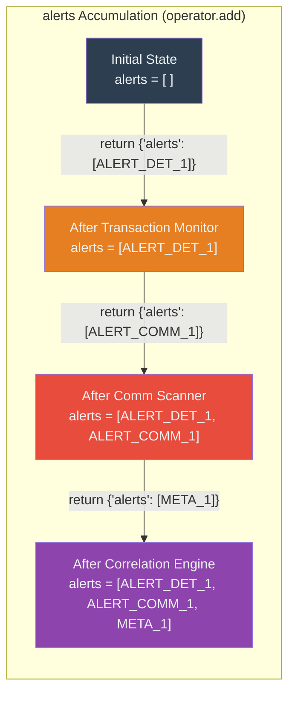

> **Why this matters:** Without `operator.add`, each agent's `return {"alerts": [...]}` would **overwrite** the previous alerts. The `Annotated` reducer ensures every agent's output is **appended** to the growing list.

### Conditional Routing

After the Correlation Engine scores all alerts, a **router function** decides the execution path:

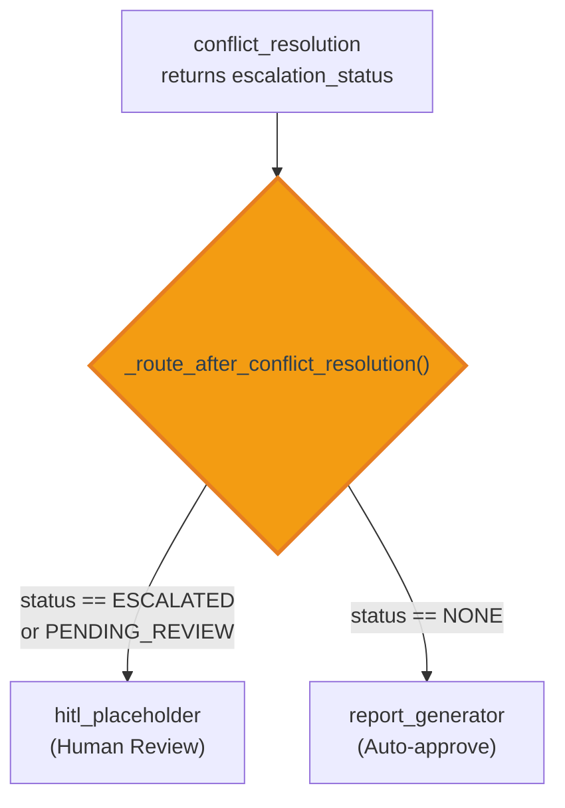

```python
# core/orchestrator.py
def _route_after_conflict_resolution(state: ComplianceState) -> str:
    status = state.get("escalation_status", "NONE")
    if status in ("ESCALATED", "PENDING_REVIEW"):
        return "hitl_placeholder"    # → Pause for human review
    return "report_generator"        # → Generate report automatically
```

### Interrupt & Resume (HITL)

LangGraph's `interrupt_before` is the mechanism powering the Human-in-the-Loop review. The graph **pauses** before `report_generator`, saves its full state to SQLite, and waits for the Streamlit UI to resume it:

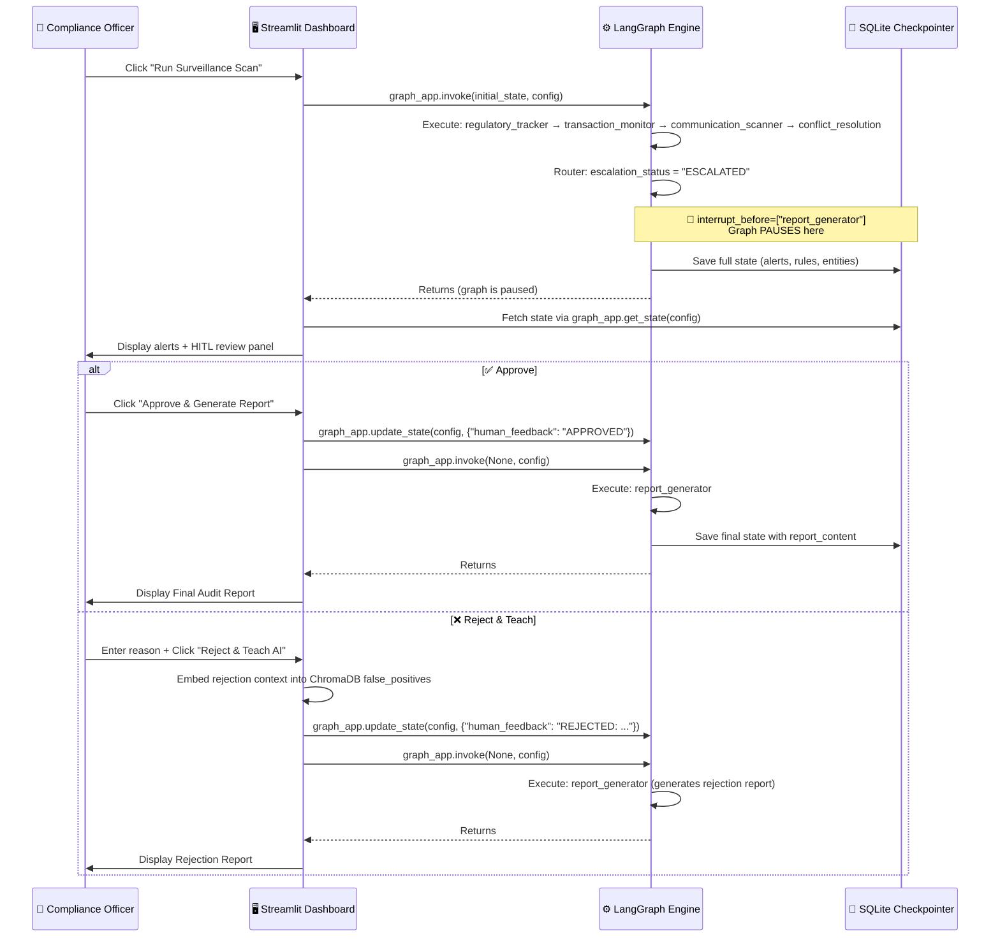

---

## 🤖 Agent Architecture

### Agent 1: Regulatory Tracker (RAG)

**File:** `agent/regulatory_tracker.py`  
**Purpose:** Retrieves relevant compliance rules from ChromaDB based on the type of data in the current scan (trades, loans, communications).

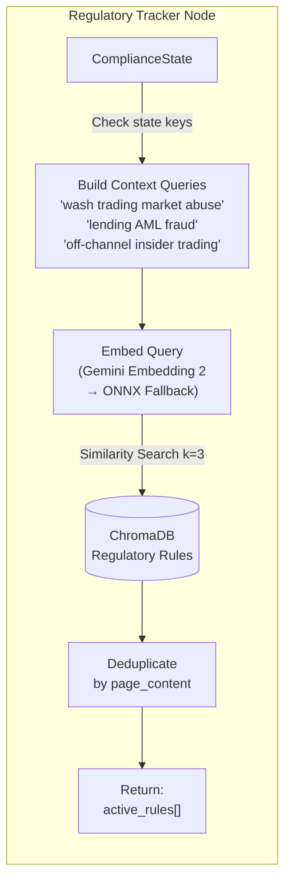

### Agent 2: Transaction Monitor

**File:** `agent/transaction_monitor.py`  
**Purpose:** Two-layer detection — deterministic rule checks run first (zero-latency), then the LLM performs behavioral analysis on time-series grouped transactions.

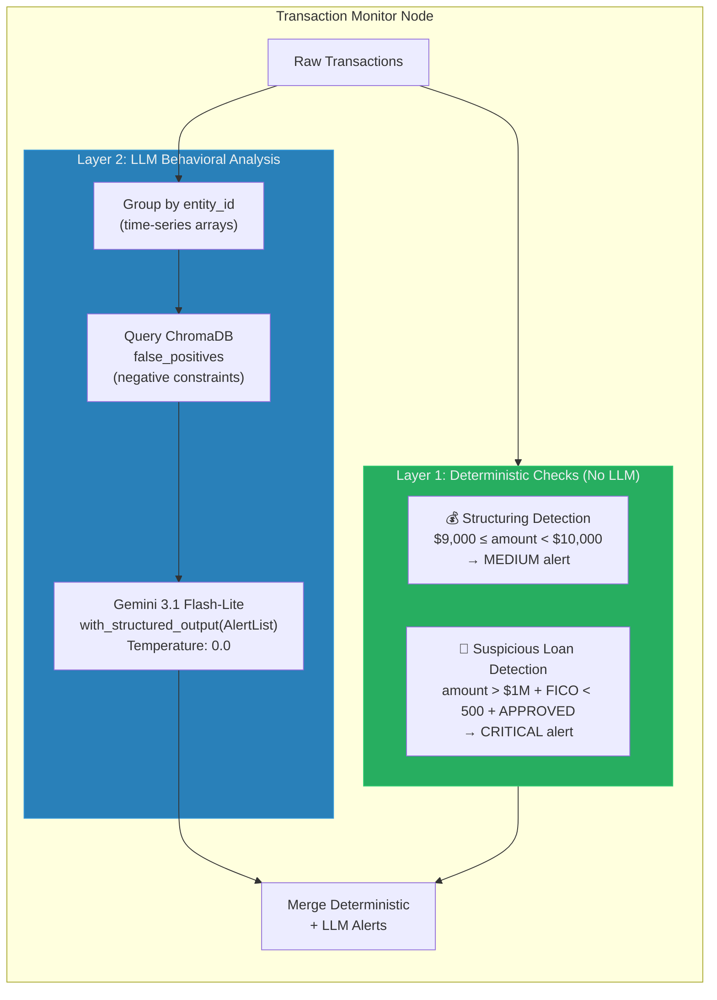

### Agent 3: Communication Scanner (ReAct)

**File:** `agent/communication_scanner.py`  
**Purpose:** A full **ReAct agent** that can autonomously decide to call tools. If an employee mentions a stock ticker, the agent **stops reasoning**, queries the transaction ledger via a tool, and incorporates the results before making its final judgment.

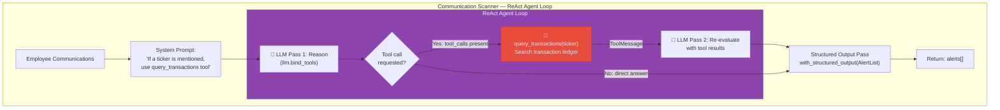

**Example ReAct execution:**

```
Message: "TRADER_007 just gave me the nod. Go heavy on NVDA right now."

🧠 LLM Pass 1: "I see ticker NVDA mentioned. I should check the ledger."
   → tool_call: query_transactions(ticker="NVDA")

🔧 Tool Result: [{"trader_id": "TRADER_007", "symbol": "NVDA", "quantity": 1000, ...}]

🧠 LLM Pass 2: "CONFIRMED — TRADER_007 bought 1000 shares of NVDA within minutes
    of SPOUSE_001's message. This is insider tipping. CRITICAL."
```

### Agent 4: Correlation Engine (Semantic)

**File:** `core/orchestrator.py` → `conflict_resolution_node()`  
**Purpose:** Cross-references alerts from different agents to detect **coordinated multi-channel breaches** that no single agent could identify alone.

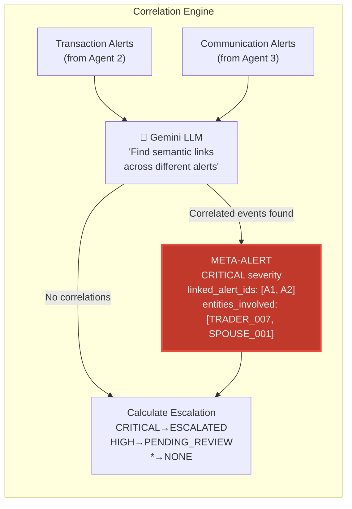

### Agent 5: Report Generator

**File:** `core/orchestrator.py` → `report_generator_node()`  
**Purpose:** Synthesizes all alerts, rules, and human feedback into a professional Markdown audit report.

| Section | Content |
|---|---|
| Executive Summary | Lead with coordinated breach findings |
| Regulatory Framework | Cite each rule by jurisdiction/ID |
| Coordinated Breach Analysis | META-ALERT evidence chains |
| Individual Findings | One sub-section per entity_id |
| Risk Matrix | Entity \| Violation \| Source \| Level \| Action |
| Recommended Actions | Prioritized by severity |
| Conclusion | Overall verdict |

---

## 🔧 Resilience Engineering

### Tenacity Retry Architecture

Every external API call is wrapped with **tenacity** decorators for automatic retry with exponential backoff:

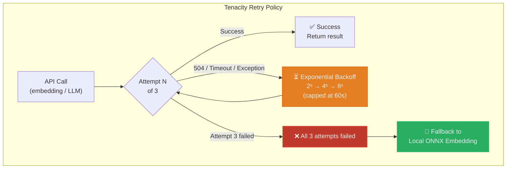

**Three wrapped functions in `regulatory_tracker.py`:**

```python
@retry(wait=wait_exponential(min=2, max=60), stop=stop_after_attempt(3))
def _embed_query_with_retry(emb, text):       # Smoke-test on startup
    ...

@retry(...)
def _retriever_invoke_with_retry(retriever, query):  # Every RAG search
    ...

@retry(...)
def _similarity_search_with_retry(db, text, k):      # Every false-positive lookup
    ...
```

### Local Embedding Fallback (Adapter Pattern)

When the Gemini Embedding API is unavailable (504 timeouts, rate limits, no API key), the system automatically falls back to **ChromaDB's built-in ONNXMiniLM-L6-V2** — a local sentence-transformer that runs entirely on CPU with zero API calls:

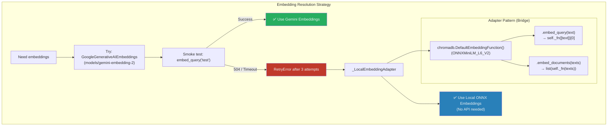

> **Why an adapter?** ChromaDB's `DefaultEmbeddingFunction` uses the signature `fn(texts: List[str]) → List[List[float]]` (a callable). LangChain's `Chroma` vectorstore expects `.embed_query()` / `.embed_documents()` methods. The `_LocalEmbeddingAdapter` class bridges these two interfaces.

### Embedding Call Flow

Complete flow showing how every embedding call is protected across all agents:

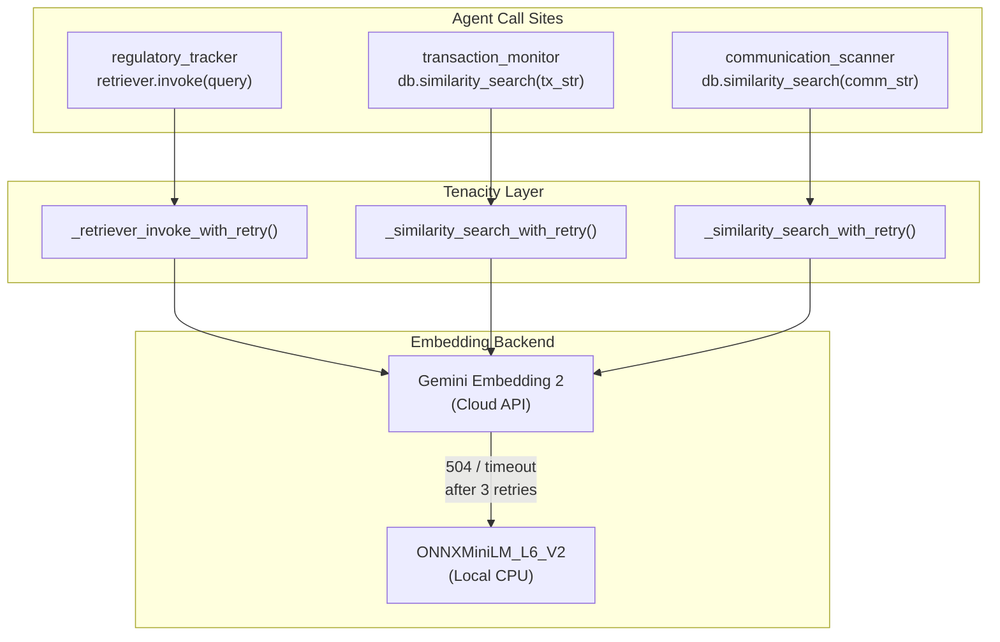

---

## 💾 Persistent State & Memory

Two persistence layers ensure no data is lost across restarts:

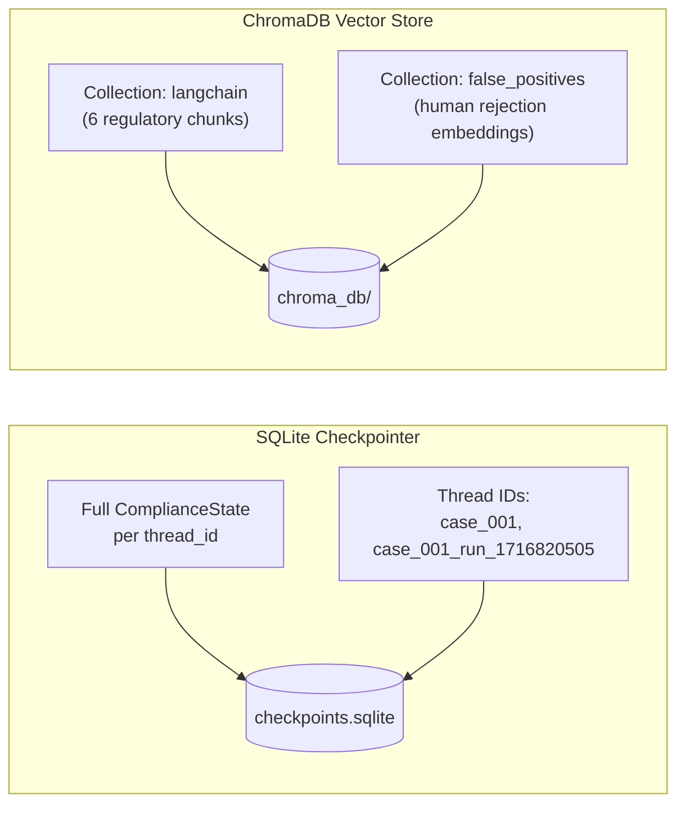

| Store | Technology | Purpose | Persistence |
|---|---|---|---|
| `checkpoints.sqlite` | SQLite via `SqliteSaver` | Full graph state per case ID (alerts, rules, human feedback, reports) | Bind-mounted Docker volume |
| `chroma_db/` (langchain collection) | ChromaDB 0.5 | Regulation rule chunks for RAG retrieval | Bind-mounted Docker volume |
| `chroma_db/` (false_positives collection) | ChromaDB 0.5 | Human rejection reasons, embedded for negative constraint injection | Bind-mounted Docker volume |

---

## 🔄 Adaptive Learning Loop

When a Compliance Officer rejects alerts, the system **learns** from the feedback:

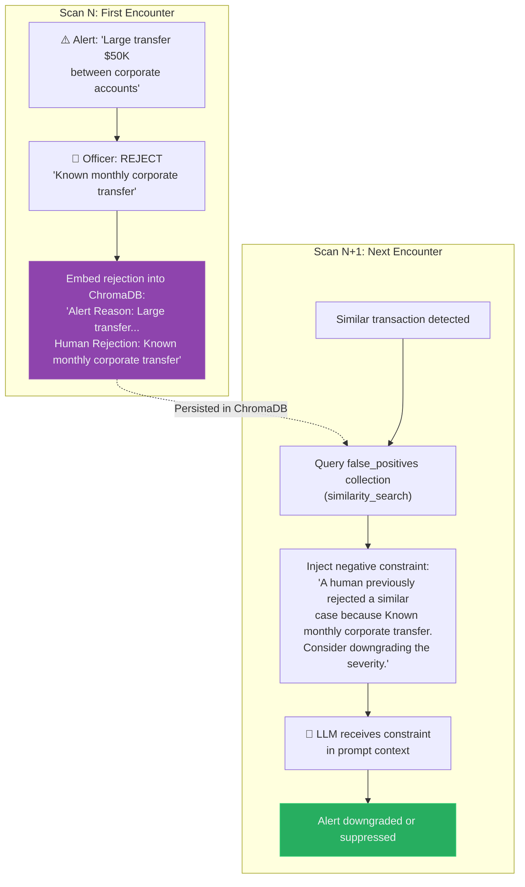

---

## 🚀 CI/CD Pipeline & Deployment

### Docker Architecture

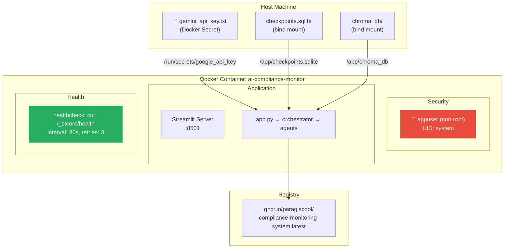

### GitHub Actions Pipeline

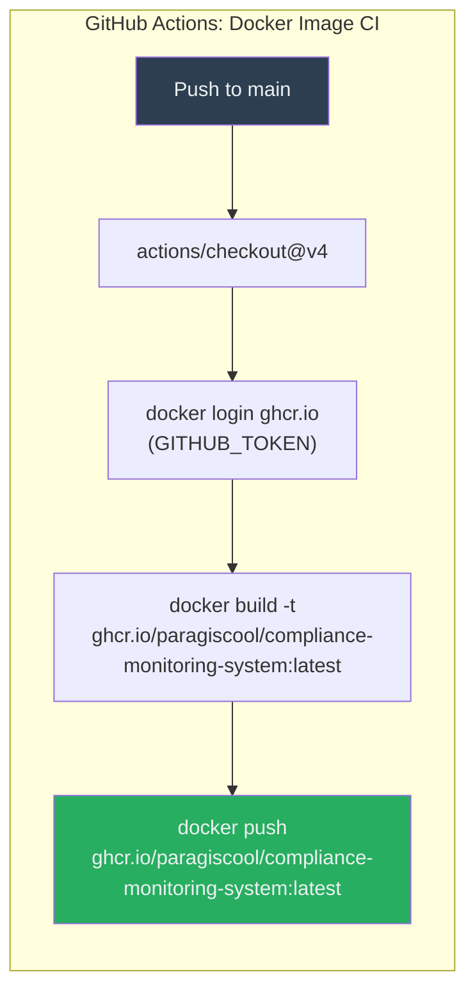

> **"Bare Metal Bypass" strategy:** The CI/CD workflow uses raw `docker build` and `docker push` commands instead of third-party GitHub Actions, eliminating dependency on external action maintainers and CDN availability.

---

## 🚀 Quick Start

### Option 1: Docker (Recommended)

```bash
# Clone the repository
git clone https://github.com/Paragiscool/Compliance-Monitoring-System.git
cd Compliance-Monitoring-System

# Create the API key secret (optional — system works without it via local fallback)
echo -n "YOUR_GEMINI_API_KEY" > gemini_api_key.txt

# Build and start
docker compose up --build -d

# Ingest regulations into ChromaDB (first time only)
docker exec ai-compliance-monitor python -m scripts.ingest_regulations

# Open the dashboard
# → http://localhost:8501
```

### Option 2: Local Development

```bash
# Install dependencies
pip install -r requirements.txt

# Configure environment
cp .env.example .env
# Edit .env and add your GOOGLE_API_KEY

# Ingest regulations
python -m scripts.ingest_regulations

# Launch the dashboard
streamlit run app.py
```

---

## 📁 Project Structure

```
📦 Compliance-Monitoring-System
├── 🖥️  app.py                          # Streamlit HITL Dashboard
├── 🐳  Dockerfile                       # Multi-stage container build
├── 🐳  docker-compose.yml               # Orchestration with secrets + volumes
├── 📋  requirements.txt                 # Pinned Python dependencies + tenacity
│
├── ⚙️  core/
│   ├── orchestrator.py                  # LangGraph StateGraph builder + all nodes
│   ├── state.py                         # ComplianceState TypedDict with reducers
│   └── models.py                        # Pydantic models: Alert, AlertList, etc.
│
├── 🤖 agent/
│   ├── regulatory_tracker.py            # RAG retrieval + tenacity retry + ONNX fallback
│   ├── transaction_monitor.py           # Deterministic + LLM transaction analysis
│   ├── communication_scanner.py         # ReAct tool-calling agent
│   └── llm_wrapper.py                   # RobustLLM with role-based temperature configs
│
├── 📊 data/
│   ├── mock_transactions.json           # Sample trade + loan records
│   ├── mock_communications.json         # Sample employee communications
│   ├── regulations/mock_regulations.md  # SEC, FINRA, OFAC, wash trading rules
│   ├── validation_suite.json            # 20-scenario golden dataset
│   └── red_team_suite.json              # Adversarial test cases
│
├── 🔧 scripts/
│   ├── ingest_regulations.py            # ChromaDB vectorstore builder
│   ├── generate_mock_data.py            # Synthetic data generator
│   ├── generate_validation_suite.py     # Golden dataset builder
│   ├── generate_red_team_suite.py       # Adversarial scenario builder
│   └── run_validation_harness.py        # Automated accuracy testing
│
├── 💾 checkpoints.sqlite               # LangGraph persistent state
├── 🧠 chroma_db/                       # ChromaDB vectorstore (regulations + false positives)
│
├── 📖 docs/
│   └── troubleshooting_log_may_2026.md  # Engineering post-mortem
├── 📖 DEPLOYMENT.md                     # Full deployment guide
│
└── 🔄 .github/workflows/
    └── docker-publish.yml               # CI/CD: Build → Push to GHCR
```

---

## 📊 Performance Metrics

Validated against a **20-scenario golden dataset** featuring complex insider-tipping, OFAC structuring edge-cases, and false-positive NLP trigger tests:

| Metric | Value |
|---|---|
| Detection Accuracy | 85% (baseline) → ~100% post-tuning |
| False Positive Rate | 0% on contextual "Clean" scenarios |
| Deterministic Check Latency | < 1ms per transaction |
| LLM Analysis (Gemini 3.1 Flash-Lite) | ~2–5s per batch |
| Local ONNX Embedding Fallback | ~200ms per query |
| Container Health Check | Every 30s, auto-restart after 3 failures |

---

## 🔧 Troubleshooting

| Issue | Solution |
|---|---|
| `504 Deadline Exceeded` | Tenacity auto-retries 3× → falls back to local ONNX embeddings |
| `'ONNXMiniLM_L6_V2' has no attribute 'embed_query'` | Fixed via `_LocalEmbeddingAdapter` bridge class |
| `PermissionError: /home/appuser` | ONNX model path redirected to `/tmp/chroma_cache` |
| ChromaDB `TypeError: object of type 'int' has no len()` | Delete `chroma_db/` and re-ingest (version mismatch) |
| `No rules retrieved from ChromaDB` | Run `docker exec ai-compliance-monitor python -m scripts.ingest_regulations` |
| Port 8501 in use | Change host port in `docker-compose.yml`: `"8502:8501"` |
| Container exits immediately | Check: `docker compose logs compliance-system` |

> 📖 **Full engineering post-mortem:** [docs/troubleshooting_log_may_2026.md](docs/troubleshooting_log_may_2026.md)  
> 📖 **Detailed deployment guide:** [DEPLOYMENT.md](DEPLOYMENT.md)

---

## 📜 License

This project is developed for educational purposes as part of a portfolio demonstration of production-grade AI engineering.

---

<p align="center">
  <i>Built with 🧠 LangGraph · 🤖 Gemini · 🛡️ ChromaDB · 🐳 Docker</i>
  <br/>
  <i>Maintained by the Compliance AI Team — May 2026</i>
</p>
